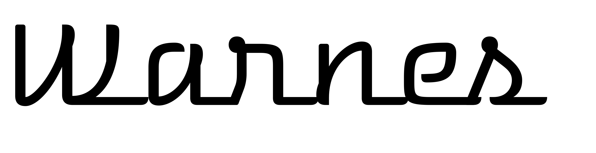
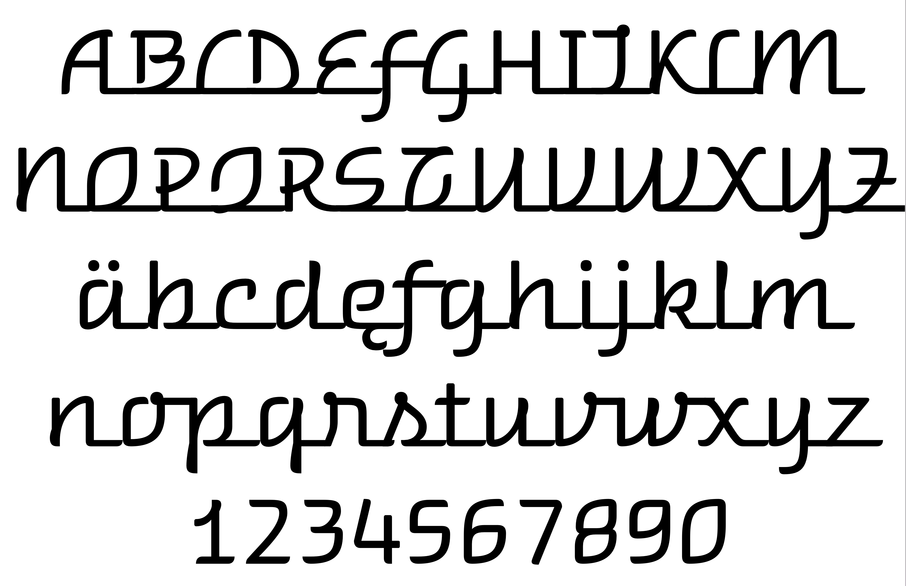

### Warnes

The retro look of this typeface reminds us of the metal badges used in the past to show car model names. The family name "Warnes" is the name of a street in the city of Buenos Aires where all the shops are garages selling spare parts.

### Designer

* Eduardo Rodríguez Tunni

### License

Licensed under the [*SIL Open Font License, 1.1*](http://scripts.sil.org/OFL); you may not use this file except in compliance with the License.

To contribute to the project contact Eduardo Rodríguez Tunni > edu@tipo.net.ar
